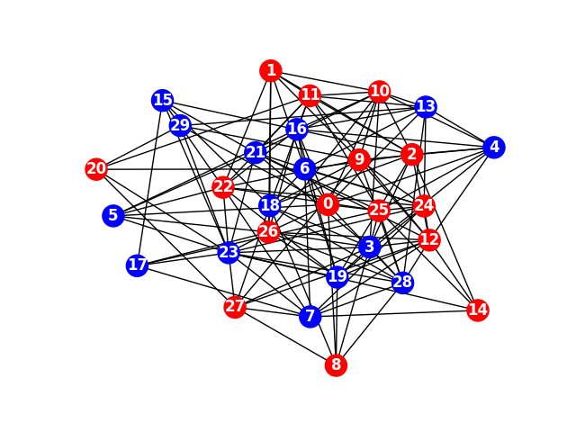

# Software Defined Networks Assignment 3

## ECMP Routing using Network X



The graph made with Erdös-Renyi model of 30 nodes(changeable as described below), each node is a switch in the topology.
We have a rate of less than 50% that each switch will have a host connected.
In the printed graph the red nodes are switches with a host.

### Required Libraries

```bash
sudo pip install simplejson
sudo pip install networkx
sudo pip install matplotlib
```


Assuming this repository is located alongside 'pox' directory (Same Parent dir) you can just:


### To Run:

```bash
./build-top.sh
./run-mn.sh
./run-pox.sh


mininet > h1 ping h<N>
mininet > h2 ping h<N>
...

mininet> quit
```

* If you want to change the number of switches in the connected graph, set the GRAPH_SIZE variable in `TopologyBuilder.py`.


#### Otherwise Before running make sure you copy following files to your `pox/ext` directory:
* `TopologyReader.py`
* `TopologyBuilder.py`
* `controller.py`
* `NetworkStructures.py`

#### And Run TopologyBuilder seperately before starting mininet and pox

